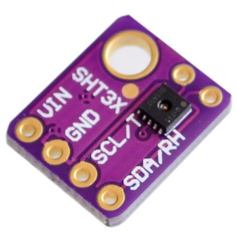
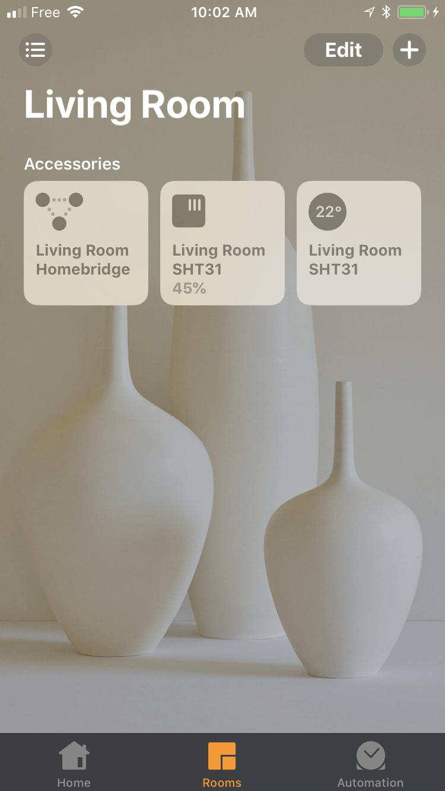
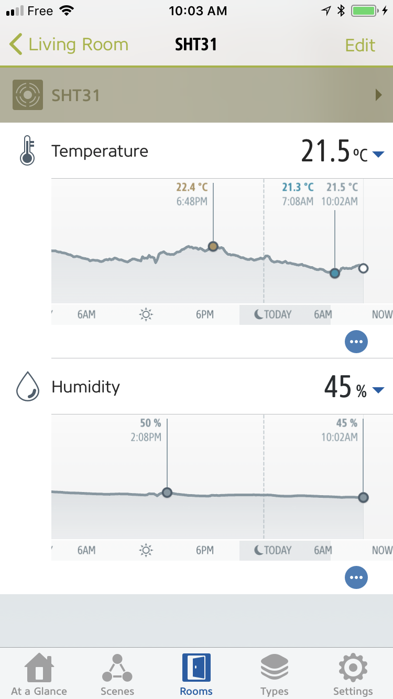

# homebridge-sht3x

[](https://www.npmjs.com/package/homebridge-sht3x)
[](https://github.com/homebridge/homebridge/wiki/Verified-Plugins)
[](https://travis-ci.org/arouanet/homebridge-sht3x)
[](https://standardjs.com)

[Homebridge](https://github.com/nfarina/homebridge#readme) plugin for the
[Sensirion SHT3x](https://www.sensirion.com/en/environmental-sensors/humidity-sensors/digital-humidity-sensors-for-various-applications/)
humidity and temperature sensor. Uses
[raspi-node-sht31](https://github.com/aphotix/raspi-node-sht31) to communicate
with the device and
[fakegato-history](https://github.com/simont77/fakegato-history) to show
historical data graphs when using the
[Eve app](https://www.evehome.com/en/eve-app).



Breakout boards for the SHT31 sensor are available from
[Adafruit](https://www.adafruit.com/product/2857) or
[AliExpress](https://www.aliexpress.com/wholesale?SearchText=sht31+sensor+breakout&SortType=total_tranpro_desc).

This plugin has only been tested on a Raspberry Pi, but should work with any
Linux-based board supported by [i2c-bus](https://github.com/fivdi/i2c-bus),
including C.H.I.P., BeagleBone, or Intel Edison.

Refer to your board documentation for instructions on how to enable the I²C
interface and how to connect an I²C device. The
[i2c-bus documentation](https://github.com/fivdi/i2c-bus#readme) also includes a
few examples.

## Installation

Node.js v10.17.0 or greater is required.

This assumes Homebridge has already been installed. If not, see the
[Homebridge documentation](https://github.com/nfarina/homebridge#installation)
for more information.

If using [_Homebridge Config UI X_](https://github.com/oznu/homebridge-config-ui-x),
search for the plugin in the Plugin screen, and install it from there.
Otherwise you can install it manually with:

```
sudo npm install -g homebridge-sht3x
```

## Configuration

If using _Homebridge Config UI X_, you can configure the plugin from the graphical
settings editor, or you can edit the `config.json` file manually.

The minimal accessory configuration, containing only the required attributes, is
as follows:

```json
"accessories": [
  {
   "accessory": "SHT3x",
   "name": "SHT31"
  }
]
```

See [config-sample.json](config-sample.json) for a complete example.

The following table shows the list of supported configuration parameters:

| Attribute   | Description                                                                    |
| ----------- | ------------------------------------------------------------------------------ |
| `accessory` | Accessory name registered with Homebridge. Has to be `"SHT3x"`.                |
| `name`      | Display name for the sensor. Can be anything you want.                         |
| `address`   | I²C address of the sensor. Possible values are `"0x44"` (default) or `"0x45"`. |
| `bus`       | I²C bus number. Defaults to `1`. See the [I²C setup](#ic-setup) section below. |
| `interval`  | Time interval at which the device is polled, in seconds (default: `60`).       |
| `history`   | Options passed to fakegato-history as an object. Empty by default.             |

### I²C setup

The default I²C bus number (`1`) is used by most Raspberry Pi models, except for
the early Raspberry Pi Model B (256MB) which uses bus number `0`. On other
boards, available buses typically are `1` or `2` on a C.H.I.P., `0`, `1`, or `2`
on a BeagleBone, and `1` or `6` on an Intel Edison. Consult your board
documentation for details, and run `i2cdetect -l` to list the available I²C
buses.

The I²C address for the SHT3x sensor is `0x44` by default, or `0x45` if the ADDR
pin is connected to logic high.

### History persistence

By default Fakegato saves history to memory, and data not yet downloaded by the
Eve app will be lost when Homebridge is restarted. If you want to save history
to disk instead, add the following line to the accessory configuration:

```
"history": {"storage": "fs"}
```

Data will be saved in a JSON file located in the Homebridge directory
(`~/.homebridge` by default unless redefined with the `-U` option) and read upon
restart. In order to store the file elsewhere, use the `path` option:

```
"history": {
  "storage": "fs",
  "path": "/tmp"
}
```

See the
[Fakegato documentation](https://github.com/simont77/fakegato-history#history-persistence)
for more information on available options.

Also note that Fakegato will automatically average out measurements and log an
entry to history every 10 minutes. If you want the history feature to work
reliably and avoid holes in the data, `interval` should be no more than `600`.

## Screenshots

<p>
  
  
</p>
